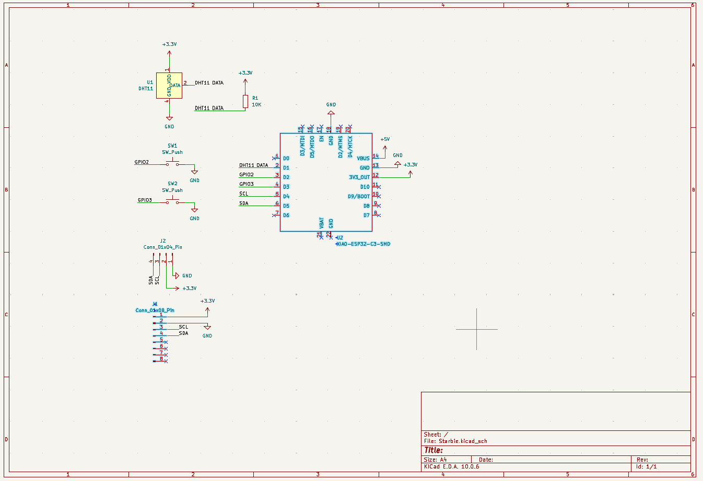

# Starbie

A tiny motion-controlled digital pet, basically a desktop Tamagotchi. Totally not a Starboy.

Starbie lives on a small PCB built around a Seeed Studio XIAO ESP32-C3. It shows its face and mood on a 0.96" OLED screen, reacts when you tilt or shake it thanks to an MPU6050 accelerometer/gyroscope, notices the temperature and humidity of the room with a DHT11, and you interact with it through two mechanical Cherry MX keys.

This is my starter project for Hack Club's **Half Life** PCB design program.



## How it works

- **Brain:** the XIAO ESP32-C3 runs the firmware and drives everything.
- **Screen:** the SSD1306 128x64 OLED shares an I2C bus with the MPU6050.
- **Motion:** the MPU6050 detects tilts, shakes and taps. That's how you play with Starbie.
- **Environment:** the DHT11 measures temperature and humidity, so Starbie can tell when it's too hot or too cold.
- **Buttons:** two Cherry MX switches for feeding, playing and navigating menus.
- **Power:** USB-C through the XIAO.

## Pinout

| XIAO pin | Connected to |
|---|---|
| D1 | DHT11 data (10 kΩ pull-up to 3.3V) |
| D2 | SW1 (to GND) |
| D3 | SW2 (to GND) |
| D4 / SDA | OLED + MPU6050 SDA |
| D5 / SCL | OLED + MPU6050 SCL |
| 3V3 | OLED, MPU6050, DHT11 |
| GND | Common ground |

The buttons pull the pin to GND when pressed, so the firmware uses the ESP32's internal pull-ups.

## Bill of materials

| Ref | Part | Qty |
|---|---|---|
| U2 | Seeed Studio XIAO ESP32-C3 | 1 |
| J2 | 0.96" SSD1306 OLED, 128x64, I2C | 1 |
| J1 | GY-521 MPU6050 module (1x08 header) | 1 |
| U1 | DHT11 temperature & humidity sensor | 1 |
| SW1, SW2 | Cherry MX switch + DSA keycap | 2 |
| R1 | 10 kΩ resistor (THT) | 1 |

## Repository layout

```
Starbie.kicad_pro     KiCad project
Starbie.kicad_sch     Schematic
Starbie.kicad_pcb     PCB layout
Week 1 Care Package/  Symbols, footprints and 3D models used by the project
firmware/             Firmware (coming soon)
images/               Screenshots (PCB render coming once routing is done)
```

## Status

- [x] Schematic
- [x] Footprints assigned
- [ ] Board outline and component placement
- [ ] Routing
- [ ] 3D render
- [ ] Firmware
- [ ] Fabrication files (Gerbers)
